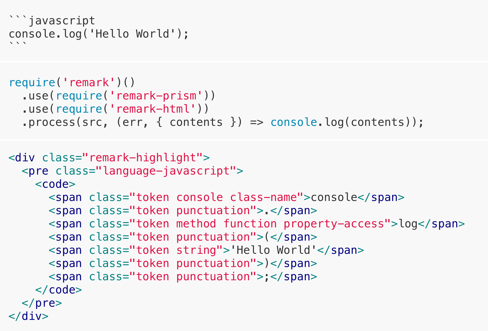

# remark-prism

Syntax highlighter for markdown code blocks using [Prism](https://prismjs.com/) - with support for certain [plugins](https://prismjs.com/plugins/). This allows syntax highlighting without running any client-side code - other than CSS.

<div align="center">
  
</div>

## installation

```bash
λ yarn add remark-prism
```

## usage

Input:

```js
const src = `
\`\`\`javascript
console.log('Hello World');
\`\`\`
`;
```

Using [remark](https://github.com/remarkjs/remark) (mdast):

```js
require('unified')()
  .use(require('remark-parse'))
  .use(require('remark-stringify'))
  .use(require('remark-prism'), {
    /* options */
  })
  .use(require('remark-html'))
  .process(file, (err, file) => console.log(String(file)));
```

Using [rehype](https://github.com/rehypejs/rehype) (hast):

```js
require('unified')()
  .use(require('remark-parse'))
  .use(require('remark-prism'), {
    /* options */
  })
  .use(require('remark-rehype'))
  .use(require('rehype-format'))
  .use(require('rehype-stringify'))
  .process(file, (err, file) => console.log(String(file)));
```

Using [mdx](https://mdxjs.com/):

```js
console.log(
  await require('@mdx-js/mdx')(src, {
    commonmark: true,
    gfm: true,
    remarkPlugins: [
      [
        require('remark-prism'),
        {
          /* options */
        },
      ],
    ],
  }),
);
```

Output:

```html
<div class="remark-highlight">
  <pre class="language-javascript">
    <code>
      <span class="token console class-name">console</span>
      <span class="token punctuation">.</span>
      <span class="token method function property-access">log</span>
      <span class="token punctuation">(</span>
      <span class="token string">'Hello World'</span>
      <span class="token punctuation">)</span>
      <span class="token punctuation">;</span>
    </code>
  </pre>
</div>
```

Take a look at our [fixtures](test/fixtures) and it's [outputs](test/outputs) to see more examples.

### `transformInlineCode`

Add relevant class names to inline code snippets. For example when you use single backtick code examples.

```js
use(require('remark-prism'), {
  transformInlineCode: true,
});
```

### plugins

It supports some [Prism](https://prismjs.com/) plugins:

```js
use(require('remark-prism'), {
  plugins: [
    'autolinker',
    'command-line',
    'data-uri-highlight',
    'diff-highlight',
    'inline-color',
    'keep-markup',
    'line-numbers',
    'show-invisibles',
    'treeview',
  ],
});
```

> _Don't forget to include the appropriate css in your stylesheets. Refer to the documentation of each plugin._

### attributes

```markdown
\`\`\`diff-javascript[class="line-numbers"][class="diff-highlight"]
```

```html
<pre class="language-diff-javascript diff-highlight line-numbers">...</pre>
```

## license

BSD-3-Clause
